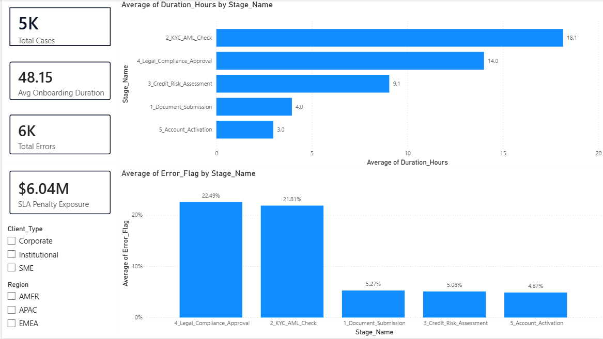

# Corporate Client Onboarding Operations & Financial Risk Analysis

## Executive Summary

This project addresses systemic operational bottlenecks and severe Service Level Agreement (SLA) financial penalty exposure within a global corporate client onboarding environment. Utilizing a high-volume dataset covering **5,000 corporate onboarding cases** across multi-stage approval pipelines, this end-to-end business intelligence solution identifies critical process delays, quantifies regulatory compliance error spikes, and models financial risk exposure using advanced Power BI (DAX) metrics and structured SQL data engineering.

### Dashboard Preview

### Key Performance Indicators (KPIs)
* **Total Onboarding Cases:** 5,000 corporate client files analysed.
* **Average Onboarding Duration:** **48.15 hours** per case across 5 core stages.
* **Total Process Errors:** **5,952 logged errors** across stage handoffs.
* **SLA Penalty Exposure:** **$6.04 Million** in accrued and projected regulatory/contractual penalties.

---

## Technical Architecture & Pipeline
+-----------------------+      +-------------------------+      +------------------------+
|  Raw Onboarding Logs  | ---> |   SQL Data Pipeline     | ---> |  DAX Modeling & Risk   |
| (5,000 Case Records)  |      | (Aggregation & Staging) |      | (Calculated Measures)  |
+-----------------------+      +-------------------------+      +------------------------+
|
v
+--------------------+
| Power BI Dashboard |
| (Executive View)   |
+--------------------+

### Stack & Tools
* **Data Warehousing & SQL:** PostgreSQL / SQL Server (window functions, subqueries, SLA logic CTEs).
* **Business Intelligence:** Power BI Desktop (New Card Visual, Custom Canvas Design, Interactive Slicers).
* **Data Modeling:** Star Schema architecture linking Client, Region, Process Stage, and SLA Reference entities.
* **Metrics & Analytics:** DAX (Dynamic filtering, percentage calculation, penalty tier calculations).

---
